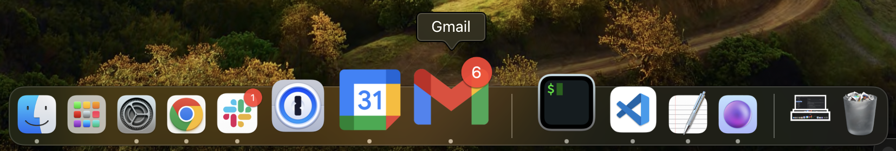

# Gmail app badge notification

You can download this extension [here](https://chrome.google.com/webstore/detail/gmail-app-badge-notificat/fbaolhbfbmniffcokakochjjeccpcpkh).

## Setup

1. Install the extension.
2. Add Gmail as an app. You can do so by following [this guide](https://support.google.com/chrome_webstore/answer/3060053?hl=en). **Make sure to select the option "Open as a window".**
3. Open the newly installed app.
